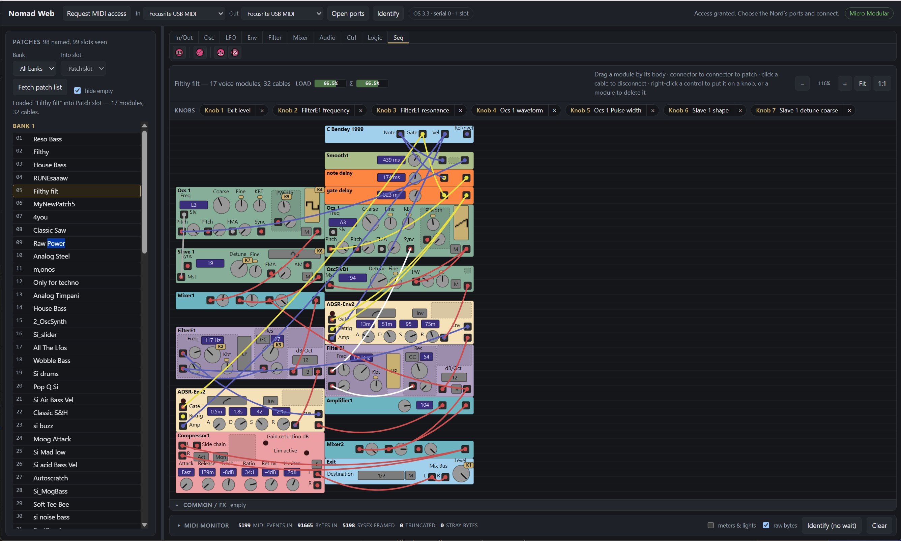

# Nomad Web

A browser-based editor for the Clavia Nord Modular, driving the hardware over Web MIDI.



**Use it in your browser: <https://simozzer.github.io/NomadWeb/>** — Chrome or Edge,
with the Nord connected over MIDI. It asks for permission to use MIDI with SysEx.

This is a port of [Nomad](http://nmedit.sourceforge.net/) 0.3.2 (Christian Schneider,
NMedit project). Nomad separated the *description* of the Nord Modular from its Java
renderer, and that separation is what makes a browser port tractable: the protocol, the
module catalogue, the panel layouts and the value formatters are all data files, carried
over here unchanged.

## Running it

```
npm install
npm run dev      # http://localhost:5173
npm test         # protocol, model and layout checks
npm run build    # static site in dist/, which runs from any folder
```

Every push to `main` runs the checks, builds, and publishes to GitHub Pages
(`.github/workflows/pages.yml`).

Web MIDI with SysEx needs a **secure context** — `localhost` during development, HTTPS
when deployed — and a permission grant. The Nord Modular is driven entirely by SysEx, so
access granted without it is refused rather than silently half-working.

Browser support: solid on Chromium (Chrome, Edge, Opera). Safari and Firefox shipped Web
MIDI more recently and are less battle-tested for SysEx-heavy use.

## What is carried over unchanged

| File | Role |
|---|---|
| `public/data/midi.pdl2` | Bit-level grammar for the whole Clavia SysEx protocol |
| `public/data/patch.pdl2` | Grammar for the `.pch` patch format |
| `public/data/modules.xml` | 110 modules: connectors, signal types, parameter ranges, DSP cost |
| `public/data/classic-theme.xml` | Pixel layout of every module panel |
| `public/data/nmformat.js` | Value formatters — original ES3, runs as-is |
| `public/data/theme-images/` | Button face graphics |
| `public/data/img/icons/16x16/` | Module toolbar icons |

Nothing about any individual module is hardcoded in the TypeScript. Adding a module means
editing the XML, exactly as it did upstream.

## Architecture

```
src/pdl2/      JPDL2 engine — lexer, parser, bit-level decode/encode
src/midi/      SysEx framing, Web MIDI transport, Nord message layer
src/model/     modules.xml, classic-theme.xml and nmformat.js loaders
src/ui/        SVG module renderer
```

The PDL2 engine is the keystone. Rather than hand-writing codecs for ~70 message types, it
interprets the grammar files directly, so the protocol spec stays the single source of
truth — including the checksum rule, which the grammar expresses declaratively.

## State

**Working and verified**

- PDL2 engine — 71 protocol rules, 132 patch rules, parsed from the spec files
- Backtracking decoder (continuation-passing), needed for the recursive
  optional chains in the patch list and patch dumps
- Device handshake, patch list, patch load and patch dump over Web MIDI
- Patch canvas laid out as the original editor shows it: the voice area above, the
  common/FX area below a draggable divider (closed when empty). Modules sit at
  their absolute grid cells — `xpos * 255`, `ypos * 15` (Nomad's
  `PBasicModuleMetrics`) — with the name on the panel, so a patch arranged here
  opens the same way in the original. A drop snaps to the grid and pushes
  overlapped neighbours down, as Nomad's `LayoutTool` does
- Patches whose positions an earlier version of this editor wrote as ranks
  (0, 1, 2…) are flagged as overlapping, with one click to spread them out
- Cables: drag, patch and cut
- Live edits sent as real messages: parameter, module move, cable add/delete
- Module catalogue and panel layouts: 1066 bindings, 382 connectors, none dangling
- Module toolbar as the Clavia editor has it: one tab per category, with the
  icons in that editor's order and groups (`public/data/module-toolbar.json`,
  read off its toolbar) and Nomad's own 16x16 icons. Click a button to preview
  its module's panel; drag it onto either area to add it
- Adding modules: the fragment `NewModuleMessage.newModule` builds (module,
  empty cables, default parameter and custom values, name), sent as one patch
  packet (cc 0x1f) quoting the slot's patch id. The drop snaps to the grid and
  pushes down what it lands on; the one-per-patch limit is enforced
- Deleting modules: right-click a module, or select it and press Delete. As in
  Nomad, its cables are cut first (one `DeleteCable` each), then `ModuleDeletion`
  (sc 0x32); its knob assignments are dropped
- DSP load meter, as the original's "Load: PVA … Σ …": each module's `cycles`
  in modules.xml is a percentage, summed per area (Nomad's
  `JTPatchSettingsBar.updateCyclesInfo`) — 41.44% for a patch the Clavia editor
  shows at 41.4%. A module that would take the total past 100% is refused
- Knobs follow the hardware: a knob turned on the device (`KnobChange`, or a
  `ParameterChange`) turns the matching control on screen
- The editor follows the device: a patch chosen on its front panel
  (`NewPatchInSlot`, NMInfo sc 0x38) is read back and shown, as Nomad's
  NmMessageHandler does; the announcement a list load causes is not re-read
- Storing the patch into a bank position (**Store…**): the dialog shows what the
  position holds now, can rename the patch first (`SetPatchTitleMessage`, sc 0x27,
  16 characters, printable ASCII but `~`), sends `StorePatchMessage` (ssc 0x0b),
  then re-reads that bank so the list confirms what the device holds
- .pch files, the Clavia editor's format (`src/model/pch.ts`). **Save file…**
  writes the patch on screen as Nomad's PatchExporter / PatchFileWriter do.
  **Open file…** reads one (PParser's rules), sends it into the slot as the
  sixteen one-section packets of `StorePatchInSlotWorker` (cc 0x1d…0x1e, command
  1, each answered before the next), then reads the slot back. The notes text,
  which the device cannot hold, is carried over from the file. Nomad's sample
  patches are the test fixtures. Where Nomad's upload sends the morph knob values
  as the keyboard assignments and ranges, this sends the real ones
- All 45 value formatters compile and evaluate
- Hardware knob assignments: read from the patch's knob map, shown as a strip
  above the canvas and a badge on each assigned control; right-click a control
  to put it on a knob, move it, or remove it (`KnobAssignmentMessage`, sc 0x25/0x26).
  On a Micro Modular only its three knobs are offered
- MIDI controller mappings: the same right-click menu maps a control to a CC
  (0-119 but 32, as Nomad allows), listing what each CC drives now; they show in
  the strip and on the control's badge (`MidiCtrlAssignmentMessage`, sc 0x22/0x23)

276 checks pass (`npm test`).

**Not yet done**

- Undo
- Editing morph assignments (they are read, kept, saved and sent, but there is
  no way to change them yet)
- Custom panel graphics — LFO shapes, envelope curves — drawn as placeholders
- Meters and LEDs are decoded but not shown on the panels

**Hardware status.** Confirmed against a real Nord Modular: device identification,
the patch list, loading a patch into a slot, and the full patch read-back — which
displays correctly on the canvas.

Confirmed on a Micro Modular: deleting modules (with their cables), controls
following knobs turned on the device, and the editor following a patch chosen on
the device's front panel.

Not yet confirmed on hardware: module move, cable add, parameter change, knob
assignment, MIDI controller mapping, adding modules, storing a patch, and
sending a .pch file to the slot.
Nor is it confirmed that the Clavia editor opens the .pch files saved here. Nor is it confirmed that the
Micro Modular's three knobs are knob ids 0-2 (knobs 1-3). They are verified
against their bit layouts in tests; try them on a patch you can afford to lose.

## Licence

Nomad is GPL v2. This port is a derivative work and carries the same licence.
The original `LICENSE_nomad.txt` applies to the data files and to this port.
